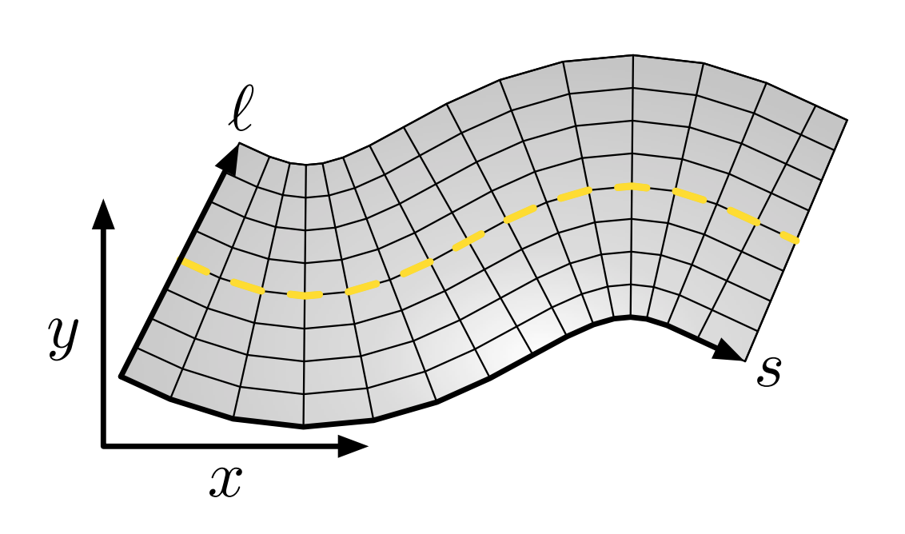
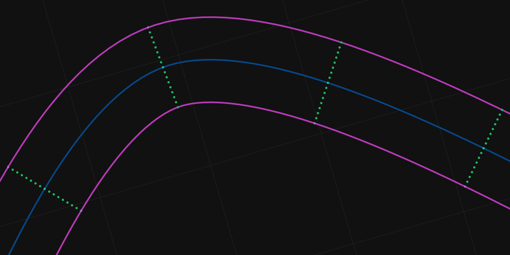
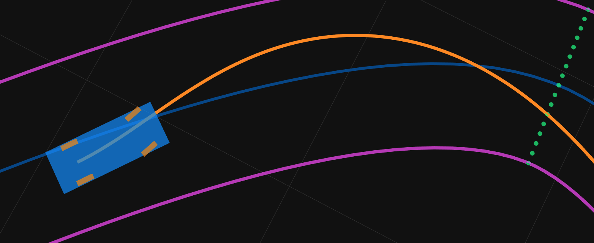
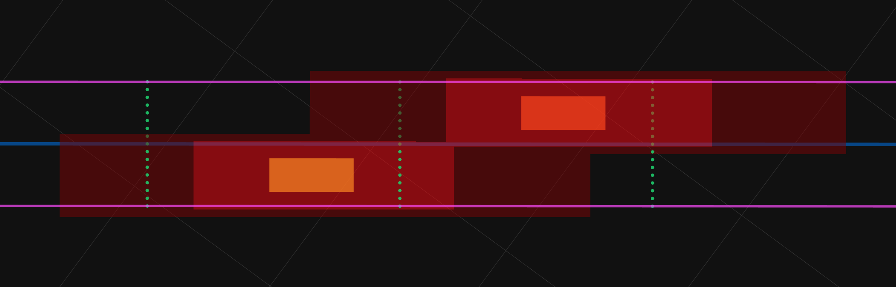
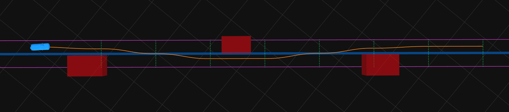

# [Dash Self-Driving Car Simulator](https://mattbradley.github.io/dash)

Real-time motion planner and autonomous vehicle simulator in the browser, built with WebGL and Three.js.


This project demonstrates a real-time, on-road, lattice-based autonomous vehicle motion planner in the browser. Many autonomous vehicle motion planners are implemented close to the metal in C or C++, or they utilize computing platforms like CUDA or OpenCL to generate plans in a highly parallel fashion on the GPU. Using WebGL, we can implement similar parallel planning algorithms right in the browser that can run on a variety of moderately-powerful consumer graphics cards. With Three.js, the motion planner can be executed in real-time 3D simulated scenarios.

This simulator is still a work-in-progress. You may see bugs, WebGL crashes, strange vehicle behavior, and any number of other failures. Currently, it is functional only in [Google Chrome](https://www.google.com/chrome/) with [hardware acceleration enabled](#enable-hardware-acceleration) and [experimental canvas features enabled](#enable-experimental-canvas-features). The target frame rate is 60fps, but it may run slower depending on how long planning takes on your hardware.

## How It Works

This motion planner is mainly based on two Ph.D. theses on parallel lattice-based trajectory planning: _Parallel Algorithms for
Real-time Motion Planning_ by Matthew McNaughton and _State Lattice-based Motion Planning for
Autonomous On-Road Driving_ by Shuiying Wang.

### SL Coordinates and the Lattice

The simulation and the vehicle run in a standard XY Cartesian coordinate system. However, for certain components, it is easier to work with a coordinate system that is influenced by the shape of the road. Where appropriate, the planner instead uses a station-latitude (SL) coordinate system. The station is the longitudinal distance along the road from some initial point, and the latitude is the lateral offset from the centerline (with negative latitudes to the left and positive latitudes to the right).



Using the SL coordinate system, a lattice is built with equally-spaced points for some spatial horizon distance along the road from the vehicle's current position. Each lattice point has an SL position, a heading, and a curvature, all fully defined by the shape of the road. The lattice points and edges joining them form a graph of trajectories; the motion planner returns the best path through this graph as decided by a cost function made up of various terms.



### Polynomial Spiral Paths

To allow for smooth driving, any path return by the motion planner must guarantee continuous curvature (meaning no discontinuous rotations of the steering wheel); it's obvious that straight edges cannot be used to connect the lattice points between stations. A polynomial spiral is a curve whose curvature is a polynomial function of it arc-length; it provides the planner with continuous curvature paths, and its coefficients can be quickly estimated using gradient descent. Edges between lattice points are created following some connectivity pattern, and the polynomial spiral coefficients for each edge are optimized in parallel using a WebGL shader. Polynomial spiral edges are also created to connect the vehicle's current position to points on the lattice.



### Obstacles

Both static and dynamic obstacles are avoided by the motion planner. Static obstacles are considered motionless during the simulation, and dynamic obstacles have their future positions calculated using their velocities and current positions. Obstacles are drawn to an obstacle cost grid with WebGL, with the dynamic obstacle cost grid having multiple "frames" representing different ranges in time. To ensure safe movement around obstacles, their sizes on the grid are dilated into two zones: the smaller collision zone and the larger hazard zone. Paths traveling through the collision zone have infinite cost and are pruned during the graph search. Paths traveling through the hazard zone have an increased cost, but are still feasible. Additionally, the dilation size is larger along the longitudinal direction compared to the lateral direction. This allows the vehicle to have a smaller latitude distance from an obstacle but a higher station distance (i.e., it is safe to be only a few feet away from a vehicle in an adjacent lane on a highway, but it is not safe to be a few feet behind a vehicle on a highway).



### Graph Search

Each 2D station-latitude lattice point is augmented into a graph vertex with three additional dimensions: a time range, a velocity range, and a constant acceleration profile. Since the search is conducted in a dynamic environment, time and velocity dimensions are added to the graph vertices. However, to avoid an exponential blowup in the size of the search space, the estimated time and velocity extrema of the planning horizon are discretized into only a few ranges. Out of all the incoming edges terminating at a specific time range and velocity range of a vertex, only the best trajectory is kept. Even though this can potentially discard optimal paths through the graph, edges falling into the same range are effectively equivalent so that the discovered path should be only slightly suboptimal.

Each graph vertex also has a corresponding acceleration profile dimension that determines the change in velocity that happens over the length of incoming trajectories. Several acceleration profiles are used, such as constant hard and soft acceleration/braking and computed accelerations to reach a target velocity like the configured speed limit or a complete stop.



#### Cost Function

Each trajectory edge that connects two graph vertices has an associated traversal cost. This cost is calculated by sampling the polynomial spiral path into distinct points (say every 0.5 meters) and summing the cost terms of each individual point. Various cost terms are used, penalizing things like: proximity to static or dynamic obstacles, lateral offsets from the center of the lane, driving in the non-preferred lane, exceeding the speed limit, accelerating or braking too hard, high lateral accelerations, etc.

#### Dynamic Programming

The assumption is made that the vehicle will only drive forwards along the road, meaning that its station is monotonically increasing. Based on this assumption, determining the total cost of a path that ends at a vertex at some station requires only the costs at the previous stations to have been computed beforehand (the cost is not dependent on later stations). This property of optimal substructure allows us to use dynamic programming to calculate the best path through the graph. The graph search starts with the vertices at the first station and iterates forwards, using the optimal paths found at the previous stations to extend the solution until the end of the spatial horizon is reached.

### WebGL and Shaders

WebGL 2 is based on OpenGL ES 3.0 (the slimmed down OpenGL version designed for embedded systems like smartphones and tablets). It provides only vertex shaders and fragment shaders, no geometry shaders or compute shaders or parallel programming frameworks. Implementing algorithms originally designed for CUDA within such constraints is certainly difficult. For example, in the original literature, the graph search algorithm uses a cost table to store the best trajectory (and its cost) found so far for each particular vertex in the graph. When expanding trajectories outgoing from a vertex, the resultant vertex (including whichever time range and velocity range it happens to fall into based on the initial time and velocity and the chosen acceleration profile) has its cost table entry updated atomically with the new trajectory if its cost is lower. This technique is impossible with GLSL shaders in WebGL. There is no shared mutable memory that a shader thread has access to that can be transferred back to the CPU. The only way to compute something in parallel in WebGL is to have each fragment in a fragment shader compute its own work item. To implement the dynamic programming graph search in GLSL, each pixel in the framebuffer is assigned a vertex of the station currently being processed. It finds the best trajectory that terminates at that vertex, and returns, as its color data, the (1) total cost, (2) final time, (3) final velocity, and (4) previous vertex. This color data is then returned back to the CPU as a texture, which is unpacked and processed to rebuild the least cost path through the graph.

Almost all of the motion planner is implemented in GLSL; you can find the shaders used for each component of the planner in the [`gpgpu-programs`](./js/autonomy/path-planning/gpgpu-programs) directory;

## Browser Support

Dash is currently fully supported only by [Google Chrome](https://www.google.com/chrome/). Chrome is the only browser that supports WebGL 2 in an OffscreenCanvas created by a Web Worker. The planner must be run in a separate thread (using a Web Worker), so that reading planning results back to the CPU doesn't block the simulation.

### Google Chrome

Both hardware acceleration and experimental canvas features must be enabled. Dash works correctly in Google Chrome on both Windows and MacOS. Linux hasn't been tested, but I've seen nothing to lead me to believe that it wouldn't work. Chromium will probably work as well.

#### Enable hardware acceleration

You can enable hardware acceleration in Settings -> Advanced -> System or by visiting:
```
chrome://settings/?search=hardware+acceleration
```

#### Enable experimental canvas features

Experimental canvas features must be enabled in order for OffscreenCanvas to be available. Enable it by visiting:
```
chrome://flags/#enable-experimental-canvas-features
```

If you can see the rotating wood box in [this Three.js example](https://rawgit.com/mrdoob/three.js/dev/examples/webgl_worker_offscreencanvas.html), then all of the correct settings should be enabled for Dash to be fully functional.

### Firefox

OffscreenCanvas can be enabled in Firefox with the `gfx.offscreencanvas.enabled` flag by visiting `about:config`.

However, even with OffscreenCanvas available, Dash doesn't work in Firefox Quantum for Windows. It appears that OffscreenCanvas is not supported in Web Workers, and running the planner causes the tab to crash. See [this Firefox ticket](https://bugzilla.mozilla.org/show_bug.cgi?id=1436036) for more information.

Dash _does_ work in Firefox Quantum for MacOS, though. But the frame rate is so low compared to Chrome, that the simulation is barely runnable.

### Edge

The simulation is mostly broken in Microsoft Edge. It doesn't currently support WebGL 2 or OffscreenCanvas.

### Safari

Safari 11.0.3 was tested on MacOS High Sierra (10.13.3), but WebGL isn't supported on that pair of versions. Safari Technology Preview supports WebGL; but it doesn't support OffscreenCanvas, so the motion planner isn't functional.

### Mobile Browsers

I haven't had any luck getting the planner to run on a mobile browser. The embedded GPU on a mobile device is probably too weak to run the planner at a reasonable frequency, anyway.

## Development

Dash is designed to run completely offline on the `file://` protocol with no local server needed to serve resources. However, if any changes are made, Webpack is used to rebuild the sources into separate app and worker distributions. Development dependencies are downloaded with [npm](https://www.npmjs.com/get-npm).

After making changes, build the project with:

```
npm run build
```

Changes can be watched and rebuilt automatically using:

```
npm run watch
```

## License

Dash is [MIT licensed](./LICENSE).
